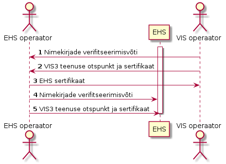
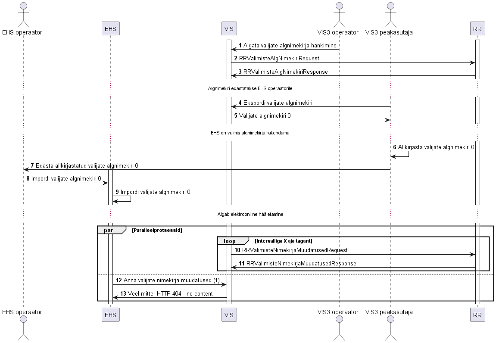
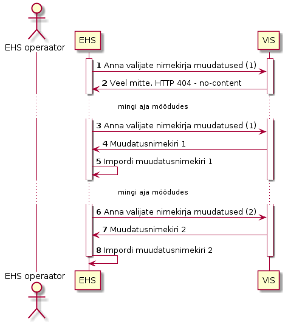
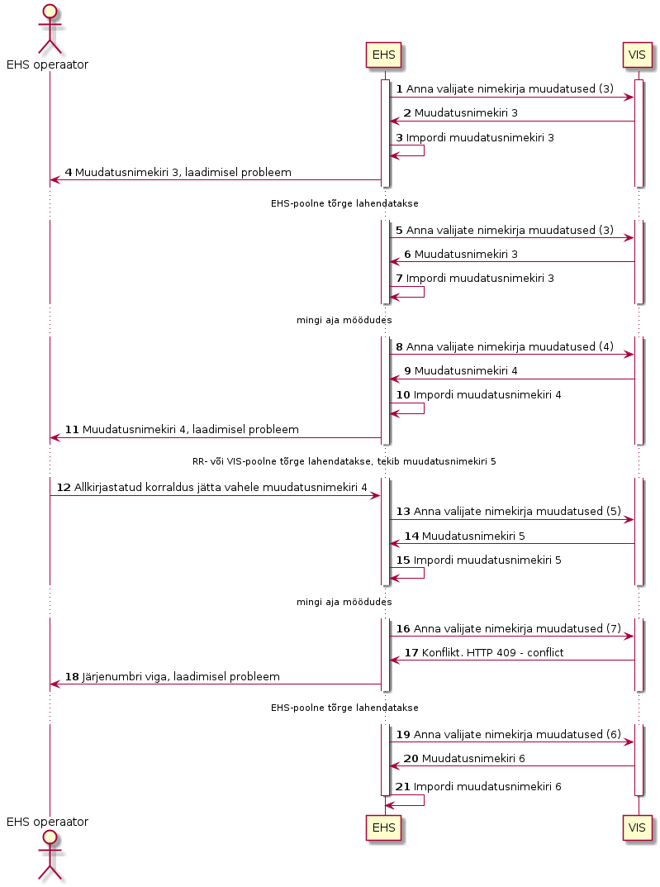

# 3  Valijate nimekiri EHS-le

## 1. Annotatsioon

Spetsifikatsioon määratleb Valimiste infosüsteemi (VIS3) ja e-hääletamise
süsteemi (EHS) vahelise liidese, mille kaudu VIS3 edastab EHS-le valijate
algnimekirja ja valijate nimekirja muudatusi ehk muudatusnimekirju.

Spetsifikatsioon on avalik. Spetsifikatsioon ei käsitle VIS3 ega EHS
konfidentsiaalset siseehitust ega liidese konfidentsiaalseid elemente.

Käesolevat spetsifikatsiooni tuleb kasutada koos VIS3 EHS API OpenAPI spetsifikatsiooniga (asub käesolevas repos, failis `vis-ehs-api.yaml`).

## 2. Sõnumivahetus nimekirjade edastamiseks

Valijate nimekirja põhjal tuvastab EHS isiku hääleõiguse ja
ringkonnakuuluvuse. Valijate nimekiri võib hääletamisperioodi jooksul muutuda,
sellest tulenevalt võib valija saada hääleõiguse, jääda oma hääleõigusest ilma
või saada hääleõiguse senisest erinevas ringkonnas. EHS peab nende muutustega
arvestama. Muudatused saab EHS VIS3 vahendusel muudatusnimekirjadena.

Spetsifikatsioonis defineeritud liidese vahendusel suhtlevad vahetult EHS ja
VIS3:

-   VIS3 liidestub Rahvastikuregistri andmekoguga ning hangib seal nii valijate
    algnimekirja kui ka muudatusnimekirjad.
-   EHS esitab VIS3-le päringuid muudatusnimekirjade saamiseks.

Kaudselt on liidesega seotud:

-   Rahvastikuregister, kus toimub nimekirjade haldamine;
-   VIS3 ja EHS operaatorid, kes vahetavad taustakanalis algnimekirja ning
    suhtlevad võimalike tõrgete lahendamisel;
-   Audiitor, kes veendub et EHS on VIS3 poolt tarnitud nimekirjad rakendanud;
-   EHS vallasrežiimis töötlemisrakendus, mis verifitseerib EHS sidusrežiimi
    komponentide poolt üle antud urni.

### 2.1 Ettevalmistused nimekirjade edastamiseks



Valijate alg- ja muudatusnimekirjade vahetamisele eelnevalt tuleb vahetada
nimekirjadele juurdepääsuks ja nimekirjade autentsuse kontrolliks vajalikud
võtmed ja sertifikaadid (sammud 1-5)

### 2.2 Valijate algnimekirja edastamine



Valijate algnimekiri järjekorranumbriga 0 laetakse EHSi haldusliidese
veebiliidesest. Valijate algnimekirja laadimine on eelduseks muudatusnimekirjade
edasiseks automaatseks laadimiseks.

Valijate algnimekirja laadimine toimub järgmistes etappides:

-   VIS3 kasutab Rahvastikuregistri X-tee teenust valijate algnimekirja
    laadimiseks (sammud 1-3).
-   VIS3 peakasutaja pärib allkirjastatud algnimekirja VIS3 teenusest, ning
    allkirjastab algnimekirja täiendavalt ID-kaardiga (sammud 4-6).
-   VIS3 peakasutaja edastab allkirjastatud algnimekirja EHS operaatorile
    (samm 7)
-   EHS operaator laeb digitaalselt allkirjastatud algnimekirja EHSi, kus
    see rakendatakse (sammud 8-9).

### 2.3 Valijate muudatusnimekirja edastamine



Valijate nimekirja muudatusnimekirja laadimise algatab EHS. Muudatusnimekirjad
on järjestatud, nii EHS kui ka VIS3 peavad arvet, milline on viimane loodud
muudatusnimekiri.

EHS algatab uue muudatusnimekirja laadimise pöördudes uue järjekorranumbriga
VIS3 vastava otspunkti poole. EHS võib varasemaid muudatusnimekirju uuesti
pärida, kasutades varasemat järjekorranumbrit.

VIS3 saab muudatused Rahvastikuregistri X-tee teenusest. VIS3 poolne muudatuste
hankimine on EHSile muudatuste esitamisest sõltumatu paralleelprotsess. See
tähendab, et üks EHSile minev muudatusnimekiri võib sisaldada mitut
Rahvastikuregistrist tulnud muudatust.

Muudatusnimekirjade edastamine EHSi käib järgmiselt:

-   EHS esitab päringu muudatusnimekirja saamiseks (samm 1)
-   Kui muudatusi ei ole, siis ei ole ka muudatusnimekirja (samm 2)
-   EHS kordab mingi aja möödudes päringut muudatusnimekirja saamiseks (samm 3)
-   VIS3 edastab vahepeal saabunud muudatused EHSile ning EHS rakendab need
    edukalt (sammud 4-5)
-   Nii VIS3 kui EHS suurendavad muudatusnimekirjade järjekorranumbrit ning mõne
    aja möödudes edastatakse uus muudatusnimekiri (sammud 6-8)

**Märkused**
- Kui järjekorras järgmise muudatusnimekirja pärimisel muudatuskirjed puuduvad
  vastatakse HTTP staatusega `404` (not found).

**Märkused**
- Kui päritakse muudatusnimekirja suurema järjenumbriga, kui tegelik järgmise
  muudatusnimekirja järjenumber, vastatakse HTTP staatusega `409` (conflict).

### 2.4 Veajuhtumite lahendamine



Muudatusnimekirjade edastamisel ei saa välistada vigu. Olenevalt vea iseloomust
on võimalik taaste, keerulisematel juhtudel tuleb mõni vigaseks osutunud
nimekiri vahele jätta. Veajuhtumi menetlemise ajal muudatusnimekirju ei
edastata.

Veajuhtumite lahendamine toimub järgmiselt:

-   EHS ja VIS3 käivitavad protokolli muudatusnimekirja edastamiseks (sammud
    1-3).
-   EHS tunnistab nimekirja vigaseks ning teavitab sellest operaatorit (samm 4).
-   Probleemi analüüsides tuvastatakse EHS-poolne tõrge, mida on võimalik
    lahendada. Tõrge lahendatakse ning EHS ja VIS3 kordavad edukalt protokolli
    (sammud 5-7).
-   EHS ja VIS3 käivitavad protokolli muudatusnimekirja edastamiseks (sammud
    8-10).
-   EHS tunnistab nimekirja vigaseks ning teavitab sellest operaatorit (samm
    11).
-   Probleemi analüüsides tuvastatakse sisuline probleem nimekirjas. Vigast
    nimekirja ei muudeta, luuakse uus korrektne nimekiri. EHS operaator laeb
    digitaalselt allkirjastatud korralduse vigase nimekirja vahele jätmiseks
    (samm 12)
-   EHS ja VIS3 suurendavad järjekorranumbrit ning käivitavad protokolli
    muudatusnimekirja edastamiseks (sammud 13-15).
-   EHS ja VIS3 suurendavad järjekorranumbrit ning käivitavad protokolli
    muudatusnimekirja edastamiseks (sammud 16-17). VIS3 vastab HTTP staatusega
    409 (conflict).
-   EHS tuvastab vale järjenumbriga nimekirja laadimise ning teavitab sellest
    operaatorit (samm 18).
-   Tõrge lahendatakse ning EHS ja VIS3 kordavad edukalt protokolli (sammud 19-21).

### 2.5 Nimekirjade loendi edastamine

## 3. Nimekirja andmevorming

Nimekirja andmevorming on sama nii valijate algnimekirja kui muudatusnimekirjade
jaoks.

Nimekiri esitatakse UTF-8-NOBOM vormingus tekstifailina. Andmestruktuuride
eraldajaks kasutatakse reavahetusmärki `LF` (ASCII-kood `0x0A`).
Andmestruktuuride väljade eraldajaks kasutatakse tabeldusmärki `TAB` (ASCII-kood
`0x09`).

Nimekiri koosneb päiseridadest ja kirjetest.

Päiseridade sisu on järgmine:

1.  `version` - andmestruktuuri versiooninumber, mille pikkus on piiratud 2
    tähemärgiga. Spetsifikatsioonile vastava nimekirja korral on selle välja
    väärtus 2.
2.  `election_identifier` - valimissündmuse identifikaator, mille pikkus on
    piiratud 28 tähemärgiga ASCII kooditabelist. Nimekirja rakendamine toimub
    ainult vastava identifikaatoriga valimissündmuse kontekstis. Valimissündmuse identifikaator peab vastama formaadile [Valimissündmuse identifikaator](../valimissündmuse_identifikaator.md).
3.  `changeset` - nimekirja järjekorranumber. Rangelt kasvav number (0, 1, 2,
    ...), mis defineerib nimekirjade rakendamise järjekorra. Algnimekirja
    järjekorranumbriks on 0.
4. `period` - nimekirjas kajastuvate muudatuste ajavahemik. Esimene väli
   sisaldab perioodi algust, teine lõppu. Algnimekirja puhul on perioodi algus
   ja lõpu väärtused võrdsed. Väli on informatiivne.

Kirje koosneb väljadest, mille sisu on järgmine:

1.  `person_code` - isikukood on valija unikaalne identifikaator, mille alusel
    EHS tuvastab isiku hääleõiguse ja ringkonnakuuluvuse.
2.  `voter_name` - valija nimi, informaalne väli, otsuste tegemisel ei kasutata.
3.  `action` - kirjega seotud tegevus. `lisamine` tähendab uue valija lisamist
    ja `kustutamine` olemasoleva valija eemaldamist.
4.  `kov_code` - haldusüksus, kuhu valija kuulub. Haldusüksuse
    identifitseerimiseks kasutatakse kohaliku omavalitsuse EHAK-koodi, Tallinna
    korral linnaosa EHAK-koodi, alaliselt välisriigis elava valija korral
    kasutatakse väärtust `FOREIGN`.
5.  `electoral_district_id` - valimisringkonna number identifitseerib
    valimisringkonna, kus valija hääletab. KOV valimiste korral kehtib
    identifikaator haldusüksuse sees. RK, EP ja RH valimiste korral on
    identifikaator haldusüksuste ülene.

Välju `voter_name`, `kov_code` ja `electoral_district_id` kasutatakse ainult
lisamiskirjes (`action` väärtus `lisamine`).

Andmevormingu formaalne kirjeldus Backus-Naur notatsioonis:

``` {.sourceCode .bnf}
# Päiseridade definitsioonid
version = "2"
election_identifier = 1*28CHAR
changeset = DIGIT
rfc3339_from = RFC3339 time
rfc3339_to = RFC3339 time
period = rfc3339_from TAB rfc3339_to


# Kirje väljade definitsioonid
person_code = 11DIGIT
voter_name = 1*100UTF-8-CHAR
action = add_action | delete_action
add_action = "lisamine"
delete_action = "kustutamine"
kov_code = 4DIGIT | "FOREIGN"
electoral_district_id = 1*10DIGIT

# Kirje definitsioon
voter =
add_action TAB person_code TAB voter_name TAB kov_code TAB electoral_district_id LF |
delete_action TAB person_code LF

# Nimekirja definitsioon
voter_list = version LF election_identifier LF changeset LF period LF *voter
```

### 3.1 Nimekirja tõlgendamine

Nimekirju töötlev rakendus lähtub järgmistest reeglitest:

1.  Nimekiri rakendatakse tervikuna.
2.  Nimekirja rakendamisele eelnevad vormingu ja kooskõlalisuse kontrollid,
    vigaseid nimekirju ei rakendata.
3.  Rakendus kontrollib nimekirja versiooni.
4.  Rakendus kontrollib valimissündmuse identifikaatorit.
5.  Rakendus kontrollib nimekirja järjekorranumbrit.
6.  Rakendus kontrollib nimekirja kõigi kirjete kooskõlalisust oma andmebaasiga.
    1.  Kooskõlalisust kontrollitakse kirjete esinemisjärjekorras.
    2.  Kui tegevus on `lisamine`, siis ei tohi vastava isikukoodiga kirjet
        rakenduse andmebaasis olla.
    3.  Kui tegevus on `kustutamine`, siis rakendus kontrollib, kas vastava isikukoodiga kirje on
        rakenduse andmebaasis olemas. Kui ei ole, siis rakendus logib veateate ja jätkab järgmiste kirjete töötlust.

Kui valijaga soetud andmeid on vaja muuta, näiteks valija liigub ühest
haldusüksusest või valimisringkonnast teise, siis kantakse valijate nimekirja
muudatuste hulka üks kustutamise kirje, millega valija oma eelmisest üksusest
kustutatakse ja üks lisamise kirje, millega valija uues üksuses valijate
nimekirja lisatakse. Ka kõik teised muudatused valija andmetes - näiteks
nimemuutus - toimuvad läbi vana kirje kustutamise ja uue lisamise.

Valijate algnimekirjas on ainult lisamiskirjed, iga valija kohta maksimaalselt
üks kirje. Muudatusnimekirjas peavad ühe valija kohta käivad kirjed olema
nimekirjas loogilises järjestuses ning liiasuseta. Ehk kustutamine enne lisamist
ning maksimaalselt üks kustutamise-lisamise paar.

On võimalik, et valimise ajal muutub valija isikukood. Sellisel juhul lisatakse
nimekirja vana isikukoodiga kustutamise kirje ning uue isikukoodiga lisamise
kirje. Täiendav korduvhääletamise kontroll ei ole selle liidese skoobis ja
teostakse VIS3 poolt eraldi.


### 3.2 Näited nimekirjadest

Valijate algnimekiri, 0.

``` {.sourceCode .bnf}
2<LF>
RK2051<LF>
0<LF>
2021-01-12T02:00:00Z<TAB>2021-01-12T02:00:00Z<LF>
lisamine<TAB>10000000001<TAB>NIMI NIMESTE1<TAB>0482<TAB>3<LF>
lisamine<TAB>20000000002<TAB>NIMI NIMESTE2<TAB>0514<TAB>7<LF>
lisamine<TAB>30000000003<TAB>NIMI NIMESTE3<TAB>0735<TAB>7<LF>
lisamine<TAB>40000000004<TAB>NIMI NIMESTE4<TAB>0482<TAB>3<LF>
lisamine<TAB>50000000005<TAB>NIMI NIMESTE5<TAB>0339<TAB>1<LF>
lisamine<TAB>60000000006<TAB>NIMI NIMESTE6<TAB>0296<TAB>4<LF>
lisamine<TAB>70000000007<TAB>NIMI NIMESTE7<TAB>FOREIGN<TAB>11<LF>
lisamine<TAB>80000000008<TAB>NIMI NIMESTE8<TAB>0793<TAB>10<LF>
lisamine<TAB>90000000009<TAB>NIMI NIMESTE9<TAB>FOREIGN<TAB>3<LF>
```

Muudatusnimekiri, 1:

1.  Muutub valija 20000000002 haldusüksus.
2.  Valija 30000000003 kaotab hääleõiguse.
3.  Valijale 11000000011 antakse hääleõigus.


``` {.sourceCode .bnf}
2<LF>
RK2051<LF>
1<LF>
2021-01-12T02:00:00Z<TAB>2021-01-13T02:00:00Z<LF>
kustutamine<TAB>20000000002<LF>
lisamine<TAB>20000000002<TAB>NIMI NIMESTE2<TAB>0735<TAB>7<LF>
kustutamine<TAB>30000000003<LF>
lisamine<TAB>11000000011<TAB>NIMI NIMESTE11<TAB>0653<TAB>4<LF>
```

Muudatusnimekiri, 2:

1.  Muutub valija 20000000002 nimi.
2.  Valija 60000000006 kaotab hääleõiguse.

``` {.sourceCode .bnf}
2<LF>
RK2051<LF>
2<LF>
2021-01-13T02:00:00Z<TAB>2021-01-14T02:00:00Z<LF>
kustutamine<TAB>20000000002<LF>
lisamine<TAB>20000000002<TAB>UUSNIMI NIMESTE2<TAB>0735<TAB>7<LF>
kustutamine<TAB>60000000006<LF>
```

Muudatusnimekiri, 3:

1.  Muutub valija 20000000003->10000000003 isikukood koos nimega.
2.  Valija 60000000006 saab hääleõiguse.

``` {.sourceCode .bnf}
3<LF>
RK2051<LF>
3<LF>
2021-01-14T02:00:00Z<TAB>2021-01-15T02:00:00Z<LF>
kustutamine<TAB>20000000003<LF>
lisamine<TAB>10000000003<TAB>UUSNIMI NIMESTE4<TAB>0735<TAB>7<LF>
lisamine<TAB>60000000006<TAB>NIMI NIMESTE6<TAB>0296<TAB>4<LF>
```

## 4. Nimekirja signeerimine

Nii algnimekirjaga kui muudatusnimekirjadega kaasatakse allkirjafail (FIPS
186-4), mille moodustab andmeallikas, arvutades algsest valijate nimekirjast
SHA256-räsi ning allkirjastades selle räsi ECDSA võtmega (kasutame P-256
kõverat). Andmeallika poolt genereeritud avalik võti tehakse taustakanalis
kättesaadavaks EHSile ning selle võtme alusel kontrollitakse EHS komponentides
valijate nimekirjade terviklust.

Võtmete genereerimiseks, signeerimiseks ning verifitseerimiseks võib kasutada
tööriista OpenSSL:

-   Võtme genereerimine: `openssl ecparam -name prime256v1 -genkey -noout -out
    private.key.pem`
-   Avaliku võtme eraldamine: `openssl ec -in private.key.pem -pubout -out
    public.key.pem`
-   Andmefaili signeerimine: `openssl dgst -sha256 -sign private.key.pem -out
    data.sig data.txt`
-   Signatuuri verifitseerimine: `openssl dgst -sha256 -verify public.key.pem
    -signature data.sig data.txt`

Näide antud meetodi kasutamiseks golang keeles on leitav repositooriumis
[DigiSign](https://github.com/e-gov/DigiSign)

## 5. Transpordiprotokoll

VIS3-EHS käesolev masinliides koosneb kahest API otspunktist.

1.  API otspunkt `ehs-voters-changeset` konkreetse muudatusnimekirja
    laadimiseks VIS3-st
2.  API otspunkt `ehs-list-election-changesets` ülevaate saamiseks avalikustatud
    nimekirjadest

Transpordiprotokoll on HTTPS, kuna volitamata ligipääs nimekirjadele tuleb
tõkestada kasutatakse mõlemapoolselt autenditud TLS ühendusi.

### 5.1 `ehs-voters-changeset`

HTTP meetod on GET. Päringu tegemisel tuleb kasutada kohustuslikke parameetreid
`changeset` ja `election_identifier`, kus

-   `changeset` on muudatusnimekirja `integer` tüüpi järjekorranumber.
-   `election_identifier` on `string` tüüpi valimissündmuse identifikaator.

Kui EHS teeb API otspunkti GET päringu, siis juhul kui vastava identifikaatori
ja järjekorranumbriga nimekiri eksisteerib, vastab VIS3
`application/octet-stream` tüüpi baidijadaga, mis esitab kahest failist
koosnevat ZIP konteinerit:

-   nimekirjafail nimega
    `<election_identifier>-voters-<changeset>.utf`
-   signatuurifail nimega
    `election_identifier<>-voters-<changeset>.sig`

Sellise vastuse korral on HTTP status 200.

Juhul kui vastava järjekorranumbriga muudatusnimekirja veel ei eksisteeri
antakse vastuses HTTP status 404.

### 5.1 `ehs-list-election-changesets`

HTTP meetod on GET. Päringu tegemisel tuleb kasutada kohustuslikku parameetrit
`election_identifier`:

-   `election_identifier` on `string` tüüpi valimissündmuse identifikaator.

Kui EHS teeb API otspunkti, siis juhul kui vastava identifikaatoriga valimine
eksisteerib, vastab VIS3 `application/json` tüüpi baidijadaga, mis sisaldab
endas JSON vormingus viiteid kõigile väljastatud muudatusnimekirjadele.

MÄRKUS. Viidetes tarnitavad URL-id ei ole õiged ja seetõttu mittekasutatavad. EHS peab konkreetse muudatuste nimekirja poole pöördumise URL-i koostama vastavalt VIS3 EHS API OpenAPI vormingus spetsifikatsioonile (asub käesolevas repos, failis `vis3-ehs-api.yaml`). VIS3 edasisestes versioonides eemaldame viidetest URL-id. 20.07.2021.

MÄRKUS. Viidetes tarnitavate URL-de käsitlust muudetud: elemendis `url` tarnitakse mitte täis-URL, vaid ainult _path_ ja -query_ osa.

``` {.sourceCode .html}
{
  changesets: [
    {
      "changeset": 0,
      "url": "/ehs-election-voters-changeset/?changeset=0&election_identifier=RK2051",
      "from": "2021-01-11T02:00:00Z",
      "to": "2021-01-12T02:00:00Z"
    },
    {
      "changeset": 1,
      "url": "/ehs-election-voters-changeset/?changeset=1&election_identifier=RK2051",
      "from": "2021-01-12T02:00:00Z",
      "to": "2021-01-13T02:00:00Z"
    },
    {
      "changeset": 2,
      "url": "/ehs-election-voters-changeset/?changeset=2&election_identifier=RK2051",
      "from": "2021-01-13T02:00:00Z",
      "to": "2021-01-14T02:00:00Z"
    }
  ]
}
```

Sellise vastuse korral on HTTP status 200.

## 6. Näited

## 7. Viited

["DigiSign" - lihtne protokoll edastatavate failide allkirjastamiseks, koos teostusnäitega](https://github.com/e-gov/DigiSign)
