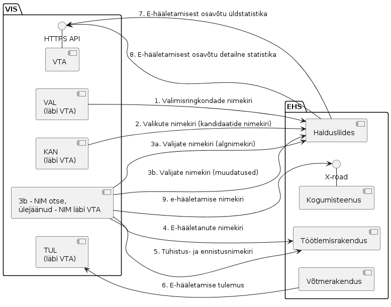

# VIS3-EHS liideste spetsifikatsioonid

Eesti riiklikel valimistel toimub e-hääletamine Valimiste infosüsteemi (VIS3) ja e-hääletamise süsteemi (EHS) koostöös. EHS roll on elektroonilise hääletamise läbiviimine lähtudes valimise definitsioonist, mis koostatakse valimise korraldaja poolt VIS3 abil. E-hääletamise ajal vahetavad EHS ja VIS3 informatsiooni - võivad muutuda valijate nimekirjad ning liigub info e-häälte laekumise kohta.

Dokument esitab VIS3 ja e-hääletamise süsteemi EHS vaheliste liideste spetsifikatsioonid.

Spetsifikatsioonid on avalikud. Spetsifikatsioonid ei käsitle VIS3 ega EHS
konfidentsiaalset siseehitust ega liideste konfidentsiaalseid elemente.

## Ülevaade

Joonis 1. VIS3 ja EHS liidesed (ülevaade).

Märkus: Joonise originaal vt VIS3 dok-s RIAs, fail "EHS".

Vasakul on VIS3, mooduli täpsusega:

- KAN - Kandidaadimoodul
- NIM - Nimekirjamoodul
- TUL - Valimistulemuse moodul
- VAL - Valimissündmuse moodul
- VTA - Valimistulemuse avalikustamise moodul.

Andmed liiguvad noole suunas. HTTPS masinliidestes on teenust pakkuvad otspunktid VIS3 poolel. X-tee liideses on teenusepakkujaks EHS.
Inim-masinliides tähendab seda, et ühe süsteemi operaator laeb faili süsteemist alla ja edastab teise süsteemi operaatorile, kes laeb faili teise süsteemi üles.

Liidesed on täpsemalt kirjeldatud allpool.

## Spetsifikatsioonid

[1 Valimisringkondade nimekiri](1_Valimisringkondade_nimekiri/SPEC.md)

[2 Valikute nimekiri (kandidaatide nimekiri)](2_Valikute_nimekiri/SPEC.md)

[3 Valijate nimekiri EHS-le](3_Valijate_nimekiri/SPEC.md)

[4 E-hääletanute nimekiri](4_e_haaletanute_nimekiri/SPEC.md)

[5 Tühistus- ja ennistusnimekiri](5_Tyhistusnimekiri/SPEC.md)

[6 E-hääletamise tulemus](6_e_haaletamise_tulemus/SPEC.md)

[7 E-hääletamisest osavõtu üldstatistika](7_e_haaletamise_yldstatistika/SPEC.md)

[8 E-hääletamisest osavõtu detailstatistika](8_e_haaletamise_detailstatistika/SPEC.md)

[9 E-hääletamiste nimekiri](9_e_haaletamiste_nimekiri/SPEC.md)

Spetsifikatsioonides kasutatav valimissündmuse identifikaator peab vastama formaadile [Valimissündmuse identifikaator](valimissündmuse_identifikaator.md).

## Usalduse loomine masinliidestes

Masinliidesed kaitstakse HTTPS-ga ja TLS mõlemapoolse autentimisega.

Lisaks piiratakse VIS3 seadistusega EHS pääs ainult EHS-le määratud otspunktidele (3b ja 7).

## Veakäsitlus masinliidestes

VIS3 peab andma HTTP standardi kohase vastuskoodi ja veateate, kui EHS saadetud päring on ebakorrektne või VIS3 ei suuda päringut teenendada.

EHS peab arvestama VIS3 tõrke võimalusega. Standardne reaktsioon tõrkele on päringu uuestisaatmine.

## Veakäsitlus faili inimese poolt edastamise liidestes

VIS3 peab kontrollima üleslaetud faili süntaksit ja kus võimalik, kas semantikat. Ebakorrektse faili kohta tuleb anda operaatorile teada. Ebakorrektse faili andmeid ei kanta VIS3 andmebaasi.

Korrektse, kuid eksitusena üleslaetud faili andmeid saab VIS3 andmebaasist kustutada ja õige fail uuesti üles laadida.

## Muudatused võrreldes VIS2-EHS-ga

VIS3-EHS liideses on võrreldes VIS2-ga muudetud ja ajakohastatud:

- osapoolte vahetumisest (valijate nimekirja hakkab EHS-le saame mitte RR/SMIT-ist, vaid RIA VIS3-st)
- valimisõiguse muutumisest (jaoskondade tähenduse muutumine)
- valijate nimekirja ja selle uuenduste edastamisest üle liidese.

VIS2 ja EHS omavahelisi liideseid spetsifitseerib "IVXV protokollide kirjeldus" (v 1.5.0, 20.04.2019), [https://www.valimised.ee/sites/default/files/uploads/eh/IVXV-protokollid.pdf](https://www.valimised.ee/sites/default/files/uploads/eh/IVXV-protokollid.pdf). "Elektroonilise hääletamise protokollistik defineerib elektroonilise hääletamise süsteemi komponentide vahelise sõnumivahetuse, kasutatavad andmestruktuurid, algoritmid ning liidesed väliste süsteemidega." Spetsifitseeritud on:

- liides "Valimisringkondade nimekiri" (jaotis 3.2)
- liides "Valikute nimekiri" (jaotis 3.4)
- liides "Valijate nimekiri" (jaotis 3.3)
- liides "Tühistus- ja ennistusnimekiri" (jaotis 9.1)
- liides "E-hääletanute nimekiri" (jaotis 9.2)
- liides "E-hääletamise tulemus" (jaotis 9.3)

Käesolevad spetsifikatsioonid tuginevad ülalnimetatud spetsifikatsioonidele. Täpsemalt vt konkreetsete spetsifikatsioonide juures.

EHS lähtekood on kättesaadav: [https://github.com/vvk-ehk/ivxv](https://github.com/vvk-ehk/ivxv).

